<div align="center">

# AlleleForge

**Variant in, corrective edit out.**

A variant-driven, multi-modality, uncertainty-aware CRISPR guide &amp; edit design framework —
across SpCas9 nuclease, base editors, and prime editors, with **population-aware** off-target
nomination and a public benchmark.

[](https://github.com/clay-good/alleleforge/actions/workflows/ci.yml)
[](https://www.python.org/)
[](LICENSE)
[](https://mypy-lang.org/)
[](https://github.com/astral-sh/ruff)

</div>

---

> [!WARNING]
> **AlleleForge is a research tool. It is not a medical device and does not provide medical advice.**
> It produces ranked, explicitly *uncertain* design hypotheses. Every off-target nomination it makes is
> **computational** and **must be experimentally validated** before any wet-lab or therapeutic use.
> See [Scope &amp; responsible use](#scope--responsible-use).

---

## Why AlleleForge

Most monogenic disease is, in effect, a copy-paste error at the allele level. The job of a genome editor
is to forge the corrective edit. Today that job is fragmented across a dozen single-purpose tools — one to
pick a guide, another to predict efficiency, a third to enumerate prime-editing extensions, a fourth to scan
for off-targets — none of which speak the same language and few of which agree on what "uncertain" means.

AlleleForge unifies the journey behind **one typed interface**: you supply a variant, it returns a ranked,
safety-annotated menu of candidate edits spanning every applicable modality, each carrying a **calibrated
uncertainty interval**, a **predicted edit outcome**, and a **population- and haplotype-aware off-target
report**.

### The four-axis gap it fills

For prime editing in particular, no existing open-source tool combines all four of:

| Axis | PRIDICT2.0 | PrimeDesign / PrimeVar | CRISPRme | **AlleleForge** |
|---|:---:|:---:|:---:|:---:|
| Therapeutic **variant** front-end | ✗ | ✓ | ✗ | ✓ |
| **ML efficiency** with calibrated uncertainty | ✓ | ✗ | ✗ | ✓ |
| **Outcome / byproduct** prediction | partial | ✗ | ✗ | ✓ |
| **Population-aware** off-target | ✗ | ✗ | ✓ | ✓ |

AlleleForge's contribution is to **wrap the best existing models** (PRIDICT2.0, BE-Hive, BE-DICT, inDelphi,
Cas-OFFinder, …) behind a unified, typed, uncertainty-honest interface and add value at the seams.

---

## Design principles

1. **Variant-first.** The canonical journey starts from *what is broken*, not from a guide.
2. **Honest uncertainty.** Every numeric prediction ships with a calibrated interval. No scorer returns a bare float.
3. **Population-aware by default.** Reference-only off-target analysis is a known safety gap (the Casgevy /
   BCL11A `rs114518452` case is the canonical cautionary tale). AlleleForge searches population variation by default.
4. **Wrap, don't rebuild.** Integrate proven tools; add new ML only at genuine coverage gaps.
5. **Reproducible to the byte.** Pinned environments, versioned datasets, deterministic seeds, content-hashed checkpoints.
6. **Three audiences, one core.** The library is the source of truth; CLI and web are thin shells over it.
7. **Typed and tested.** `mypy --strict`, `ruff`, and Hypothesis property tests on all core logic.
8. **Cite everything.** Every dataset, model, and scoring function carries a literature citation and a version.

---

## Architecture

AlleleForge is strictly layered: lower layers know nothing about higher ones. The **Designer** is the only
component that sees the whole pipeline; every domain service is independently testable and usable.


### The variant-first journey

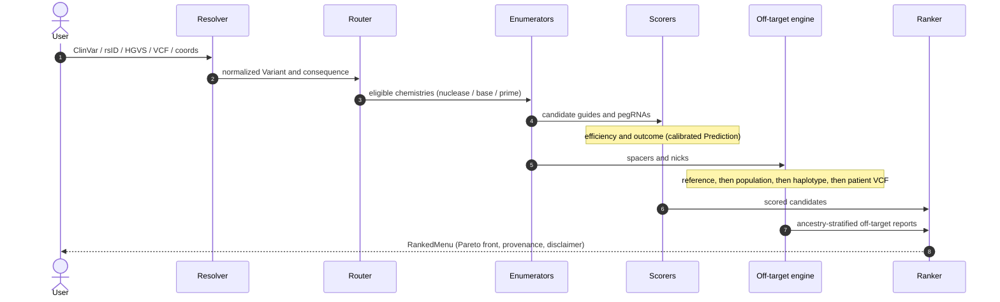

---

## Build status &amp; roadmap

AlleleForge is built in ordered phases (see [`SPEC.md`](SPEC.md), the authoritative build contract). Phases
0–5 establish the spine before any modality or ML code.

| Phase | Component | Status |
|---|---|:---:|
| 0 | Repo bootstrap, CI, packaging, Rust toolchain | ✅ done |
| 1 | Core domain types &amp; schemas (`types/`) | ✅ done |
| 2 | Genome access &amp; indexing (`genome/`) | ✅ done |
| 3 | Data registry &amp; population datasets (`data/`) | ✅ done |
| 4 | Variant resolver (`variant/`) | ✅ done |
| 5 | Off-target engine — population &amp; haplotype aware (`offtarget/`) | ✅ done |
| 6 | Scoring foundations: model zoo, embeddings, uncertainty (`scoring/`, `model_zoo/`) | ✅ done |
| 7 | Chemistry: SpCas9 nuclease (`enumerate/`, `scoring/`, `design/`) | ✅ done |
| 8 | Chemistry: base editing — ABE / CBE (`enumerate/`, `scoring/`, `design/`) | ✅ done |
| 9 | Chemistry: prime editing — the flagship (`enumerate/`, `scoring/`, `design/`) | ✅ done |
| 10 | Designer: routing, candidate menu, ranking (`design/`) | ✅ done |
| 11 | Reporting &amp; oligo output (`report/`) | ✅ done |
| 12 | CLI (`aforge`) (`cli/`) | ✅ done |
| 13 | Web UI &amp; API (`web/`) | ✅ done |
| 14 | CRISPR-Bench: tasks, frozen splits, metrics, runner, leaderboard (`benchmark/`) | ✅ done |
| 15 | Docs, examples, release | ⏳ next |

---

## Install

> AlleleForge targets **Python ≥ 3.11**. The core install is deliberately light; heavy scientific, ML, and
> web stacks live in optional dependency groups so the base package installs fast and CI stays reliable.

```bash
# Core library (light: pydantic types, config, model-card parsing — no torch/numpy)
pip install alleleforge            # once published to PyPI

# From source, with the optional groups you need
git clone https://github.com/clay-good/alleleforge
cd alleleforge
pip install -e ".[core,genome,variant,cli,ml,dev]"
```

### Optional dependency groups

| Group | Pulls in | Needed for |
|---|---|---|
| `core` | polars, pyarrow, numpy | tabular I/O |
| `genome` | pyfaidx, pysam, cyvcf2, mappy, pyliftover | reference access, indexing (Phase 2) |
| `variant` | hgvs | HGVS resolution (Phase 4) |
| `cli` | typer | the `aforge` command-line interface (Phase 12) |
| `web` | fastapi, uvicorn, httpx | the web API + served frontend (Phase 13) |
| `ml` | torch, transformers, lightning, scikit-learn | real embedding backbones (Phase 6+); the uncertainty core needs none of these |
| `web` | fastapi, uvicorn | API server (Phase 13) |
| `docs` | mkdocs-material, mkdocstrings | documentation site |
| `dev` | ruff, mypy, pytest, hypothesis, maturin | development |

### Native acceleration (optional)

The performance kernels live in a PyO3 crate built with [maturin](https://github.com/PyO3/maturin).
AlleleForge imports and runs cleanly **without** it (pure-Python mode); build it for speed:

```bash
pip install maturin
cd rust && maturin develop --release      # builds & installs aforge_native
```

`alleleforge._native.NATIVE_AVAILABLE` reports whether the compiled extension is present.

---

## Quickstart

> The end-to-end design pipeline is **live**: `alleleforge.design.design()` resolves a variant, routes it
> to every eligible chemistry, enumerates and scores candidates, runs population-aware off-target, and
> returns a ranked, explained menu (see [the designer section](#the-designer-one-variant-every-chemistry-one-ranking-phase-10-shipping-now)),
> and [reporting & oligo output](#from-menu-to-bench-reporting--oligo-output-phase-11-shipping-now) renders it to
> cloning-ready oligos, HTML, PDF, JSON, and TSV. The whole pipeline is driven from the
> [`aforge` CLI](#the-aforge-cli-phase-12-shipping-now) and the
> [web API + browser UI](#web-ui--api-phase-13-shipping-now), and the same scorers are graded by
> [CRISPR-Bench](#crispr-bench-a-calibration-first-benchmark-phase-14-shipping-now). What remains is the
> v0.1.0 release (15). The snippets below show the lower-level building blocks the designer composes.

```python
from alleleforge.types import DNASequence, Prediction, UncertaintyMethod

seq = DNASequence("ACGTRYN")           # validates IUPAC alphabet
print(seq.reverse_complement())        # ambiguity-aware: R↔Y, N↔N → "NRYACGT"

# Every numeric prediction carries a calibrated interval, never a bare float.
p = Prediction(value=0.72, interval=(0.61, 0.83), method=UncertaintyMethod.ENSEMBLE,
               in_distribution=True, calibrated=True)
print(p.interval_level)                # 0.80 by default
```

**Resolve a variant** — every input form normalizes to one canonical, left-aligned record:

```python
from alleleforge.variant import resolve, RawTarget
from alleleforge.types import DNASequence

# A raw target sequence with a marked edit — no reference file needed.
rv = resolve(RawTarget(sequence=DNASequence("ACGTAACGTACGT"), position=4, ref="A", alt="G"))
print(rv.variant)            # target:4:A>G
print(rv.working_interval)   # 0-based half-open analysis window around it

# With a reference genome, indels are left-aligned and the asserted ref is
# validated against the build (a mismatch is a hard error — likely wrong build):
#   resolve("chr2:g.5226001del", reference=hg38, dbsnp=dbsnp_db)
#   resolve("VCV000012345", clinvar=clinvar_db)   # ClinVar accession → Variant
```

**Inspect the data registry** — every external dataset is versioned and license-aware:

```python
from alleleforge.data import DEFAULT_REGISTRY

print(DEFAULT_REGISTRY.names)                 # ('1000g', 'clinvar', 'dbsnp', 'encode', ...)
clinvar = DEFAULT_REGISTRY.get("clinvar")
print(clinvar.version, clinvar.license)       # 2024-05  public-domain (NCBI)
# Non-redistributable sources are never vendored; downloads are consent-gated
# and checksum-verified. See docs/data.md for the full provenance table.
```

The same journey from the `aforge` CLI (`pip install "alleleforge[cli]"`):

```bash
# Variant → ranked, safety-annotated menu, rendered as an interactive HTML report
aforge design VCV000012345 --reference-fasta hg38.fa \
    --intent correct --populations afr,eur,eas --format html --out report.html

# Standalone population/haplotype-aware off-target for a spacer
aforge offtarget GACGGAGGCTAAGCGTCGCAA --reference-fasta hg38.fa --pam NGG --json

# Normalize any input form and show its class (debugging aid)
aforge resolve chr2:100:A>G --json
```

---

## The variant-first front end (Phases 2–4, shipping now)

Phases 2–4 implement everything from *an input* to *a validated, annotated variant with its genomic
context* — the foundation every modality plugs into.

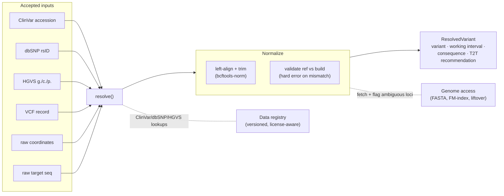

**Coordinate convention cheat-sheet.** Internals are uniformly **0-based half-open**; only I/O
boundaries are 1-based. Every parser converts on read.

| Surface | System | Converted by |
|---|---|---|
| AlleleForge internals (`GenomicInterval`, `Variant.pos`) | **0-based half-open** | — (canonical) |
| ClinVar / gnomAD / dbSNP VCF | 1-based | `pos − 1` on read |
| GENCODE GTF | 1-based inclusive | `[start − 1, end)` on read |
| ENCODE bedGraph | 0-based half-open | unchanged |
| HGVS (`g.`), human-readable reports | 1-based | boundary helpers only |

**Dataset provenance** (pinned, versioned, citation-stamped — full table in [`docs/data.md`](docs/data.md)):

| Dataset | Version | License | Role |
|---|---|---|---|
| ClinVar | 2024-05 | Public domain | accession → variant + significance |
| gnomAD | v4.1 | CC0-1.0 | per-population allele frequencies |
| 1000 Genomes | phase 3 high-cov | Public (IGSR) | phased common haplotypes |
| HGDP | gnomAD v3.1 | CC0-1.0 | ancestry breadth |
| dbSNP | b156 | Public domain | rsID ↔ locus |
| GENCODE | v47 | Open | gene models / transcripts |
| ENCODE | 2024 | Open | chromatin tracks |

---

## The off-target engine (Phase 5, shipping now)

AlleleForge's safety core, and its clearest point of novelty: off-target nomination that is
**reference-, population-, and haplotype-aware** for every chemistry, behind one `search()` call that
returns an **ancestry-stratified** report. Reference-only off-target analysis has a known blind spot —
a minor allele can create a *de novo* PAM the reference never shows — and because allele frequencies
differ by ancestry, that blind spot concentrates risk in under-represented populations.

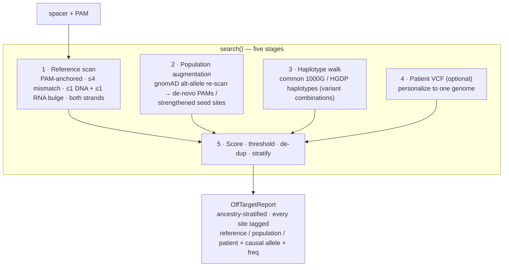

Every site records **where it came from** — the reference, a population variant (which allele, which
populations, at what frequency), or a patient's VCF — so a nomination can be audited, not trusted
blindly. The report's worst-case is computed against the **worst-affected ancestry**, never the
average.

### Reference bias, reproduced

The canonical cautionary tale is the BCL11A enhancer variant `rs114518452` (Cancellieri &amp; Pinello,
*Nat Genet* 2023). AlleleForge reproduces it as an integration test: a reference-only scan returns
**zero** sites, while the population-aware scan nominates the high-CFD off-target the minor allele
creates — ancestry-stratified, with its African-ancestry-enriched frequency recorded.

```python
from alleleforge.offtarget import search
from alleleforge.types.guide import PAM

report = search(spacer, PAM(pattern="NGG"), reference=hg38, gnomad=gnomad_db)
for site in report.sites:
    print(site.origin, round(site.score, 2), site.causal_allele, site.populations)
worst = report.worst_ancestry()        # ('afr', 1.0) — flagged, not averaged away
```

### Specificity scoring cheat-sheet

| Score | Source | Status in AlleleForge |
|---|---|---|
| **MIT / Hsu** | Hsu et al., *Nat Biotechnol* 2013 | Exact — published 20-position weight table |
| **CFD** | Doench et al., *Nat Biotechnol* 2016 | Published PAM table; mismatch weights default to a transparent seed model, **injectable** with the exact Doench matrix |
| **CFD-Cas12a** | analog | Seed at the PAM-proximal 5' end, `TTTV` PAM |

All three sit behind one swappable `OffTargetScorer` protocol, so a Phase 6 ML scorer drops in
without touching the engine. Reporting thresholds default to **CFD ≥ 0.20 or MIT ≥ 0.10**.

> The genome-scale search is the Rust FM-index seed-and-extend kernel; until that crate is built,
> AlleleForge ships a *correct* pure-Python linear-scan fallback (CI never blocks on the native build).

---

## The scoring substrate (Phase 6, shipping now)

Before any chemistry-specific predictor, AlleleForge establishes the reusable ML substrate: a
**license-gated model zoo**, a **swappable embedding backbone**, and the **calibrated-uncertainty**
machinery that realizes the honest-uncertainty principle. The whole substrate is pure stdlib in its
core path — no numpy or torch — so it runs in CI on a weight-free stub embedder; real 500M-parameter
backbones are gated behind the `real_weights` marker.

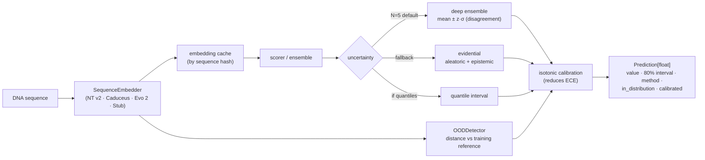

**No bare floats.** Every scorer returns a `Prediction`, never a number; `ensure_prediction` is the
runtime guard at the orchestration seam. **No undocumented models.** Every checkpoint loads through the
model zoo, which refuses a missing card, a license that forbids the use, or an unverifiable hash, and
surfaces a `ModelCheckpoint` into result provenance.

### Uncertainty method cheat-sheet

| Method | Role | Interval |
|---|---|---|
| **Deep ensemble** (N=5) | default | `mean ± z·σ` from member disagreement — **widens on OOD** |
| **Evidential** (NIG) | single-model fallback | splits aleatoric (data) vs epistemic (model) variance |
| **Quantile** | when the model emits quantiles | read off the `(1±level)/2` quantiles |
| **Isotonic calibration** | post-hoc, all of the above | PAV fit; `expected_calibration_error` quantifies the gain |

```python
from alleleforge.scoring import DeepEnsemble, ensemble_prediction, OODDetector, StubEmbedder

ens = DeepEnsemble([m1, m2, m3, m4, m5])                 # five members
emb = StubEmbedder().embed(["GACCATGCAACCTTGAACGT"])[0]   # NT v2 in production
ood = OODDetector(training_reference)                     # embedding-space density
pred = ensemble_prediction(ens.predict(features), in_distribution=ood.is_in_distribution(emb))
print(pred.value, pred.interval, pred.method, pred.in_distribution)   # honest by construction
```

---

## The first chemistry: SpCas9 nuclease (Phase 7, shipping now)

The most mature chemistry, and the right one to prove the **full vertical slice** end to end. From a
resolved variant, `design_cas9` enumerates guides, scores efficiency and outcome with calibrated
uncertainty, runs the population-aware off-target engine, and returns ranked candidates.

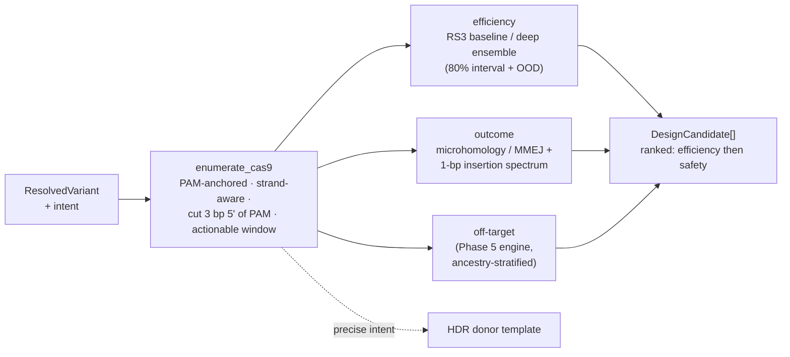

**Defaults & decisions.** Primary PAM `NGG`; `NG` (SpCas9-NG) and `NRN`/`NYN` (SpRY) are emitted only
when no `NGG` guide is actionable **and** opted in. Cut site 3 bp 5' of the PAM. The actionable window
is tight around the edit for precise intents (HDR efficiency falls off with cut-to-edit distance) and
the whole working interval for a knock-out, which marks frameshift outcomes as intended.

| Axis | Default (CI, weight-free) | Trained alternative (model zoo, `ml` extra) |
|---|---|---|
| Efficiency | RS3-style feature baseline + backbone deep ensemble | Rule Set 3; fine-tuned NT v2 ensemble |
| Outcome | microhomology/MMEJ + 1-bp insertion model | inDelphi (default) · Lindel · X-CRISP + agreement |
| Off-target | Phase 5 engine (pure-Python fallback) | Phase 5 engine (Rust FM-index) |

Every efficiency score carries an 80% interval and an OOD flag; every outcome is a normalized
distribution over indel alleles; every candidate carries an ancestry-stratified off-target report —
so a ranked menu is honest about what it does and does not know.

---

## Base editing: the bystander problem (Phase 8, shipping now)

Base editors install a single transition (ABE: A·T→G·C; CBE: C·G→T·A) without a double-strand break,
within a narrow activity window. The hard part is the **window outcome**: of the editable bases in the
window, which get edited — and what *bystanders* ride along. AlleleForge enumerates every sgRNA placing
the target base in-window per editor, predicts the window-allele distribution, and ranks by the
probability of the **exact** intended allele while minimizing bystander burden.

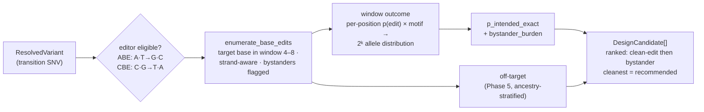

**Declarative editor registry.** ABE8e, CBE4max, and evoCDA1 ship as data; adding an editor (deaminase,
chemistry, window, PAM, motif preference) is a one-descriptor change, not code.

| Editor | Deaminase | Edit | Window | Motif preference |
|---|---|---|:---:|---|
| **ABE8e** | TadA-8e | A→G | 4–8 | none (broad) |
| **CBE4max** | APOBEC1 | C→T | 4–8 | TC (prefers 5′ T) |
| **evoCDA1** | evoCDA1 | C→T | 2–10 | none (broad window) |

Every candidate carries the tradeoff explicitly — `bystander-present:N` / `clean`, a `bystander-burden`
score, the full window-allele distribution, and an ancestry-stratified off-target report — so the
recommendation is the cleanest editor/guide combination, not just the first one found.

---

## Prime editing: the four-axis flagship (Phase 9, shipping now)

Prime editing is the chemistry where AlleleForge contributes the most. PRIDICT2.0 is SOTA for
efficiency but has no variant front-end and no off-target module; PrimeDesign/PrimeVar give
ClinVar-to-pegRNA but only rule-based scoring and reference-only off-target; CRISPRme does population
off-target but designs no pegRNAs. **AlleleForge stitches all four axes together and fills the seams.**

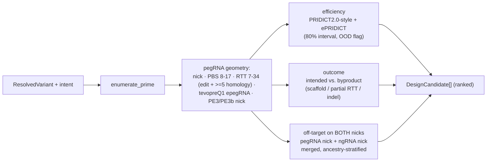

| Axis | PRIDICT2.0 | PrimeDesign / PrimeVar | CRISPRme | **AlleleForge** |
|---|:---:|:---:|:---:|:---:|
| Therapeutic **variant** front-end | no | yes | no | **yes** |
| **ML efficiency** + calibrated uncertainty | yes | no | no | **yes** |
| **Outcome / byproduct** prediction | partial | no | no | **yes** |
| **Population-aware** off-target | no | no | yes | **yes** |

**Honest by construction.** PRIDICT2.0 is trained on HEK293T/K562; any other cell context flags the
efficiency prediction out-of-distribution and raises an `ood` flag rather than hiding it. The
off-target engine runs on the pegRNA nick **and** the ngRNA nick, merging into one ancestry-stratified
report. The PE3b nicking guide is preferred when a seed-disrupting ngRNA exists (it nicks only the
edited strand, suppressing indels). See the canonical journey end to end in
[`examples/01_clinvar_to_design.ipynb`](examples/01_clinvar_to_design.ipynb).

---

## The designer: one variant, every chemistry, one ranking (Phase 10, shipping now)

The keystone that realizes the variant-first promise end to end. `design()` takes any input form, decides
which chemistries can biologically make the edit, generates and scores candidates from each, ranks them on
**one footing**, and returns an explained `RankedMenu` with a Pareto front and full provenance.

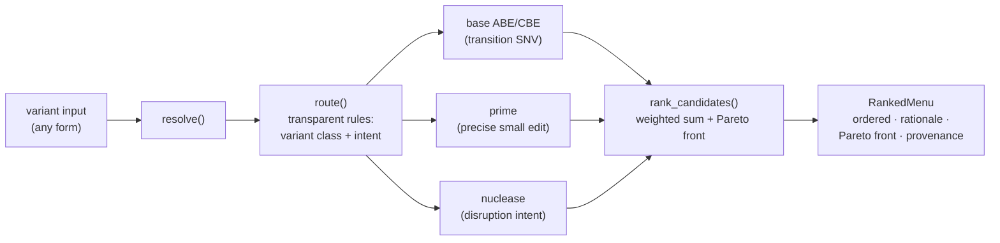

**Routing is transparent and inspectable.** Each rule is a chemistry paired with a one-line biological
rationale and a pure `(resolved, intent)` predicate. Adding or relaxing a rule is a one-line data change,
and `route()` explains every verdict — kept *and* dropped.

| Chemistry | Eligible when | Biological reason |
|---|---|---|
| Base editing (ABE) | transition SNV, required change `A:T→G:C` | one in-window transition, no double-strand break — the cleanest fix |
| Base editing (CBE) | transition SNV, required change `G:C→A:T` | same, complementary transition |
| Prime editing | any precise small edit (≤ RTT length), non-disruptive intent | arbitrary substitutions / short indels from an RTT template, no break |
| SpCas9 nuclease | disruption (knock-out) intent | a break repaired by NHEJ yields frameshifting indels |

**Ranking puts every chemistry on one footing.** Candidates are projected onto four shared,
higher-is-better objectives and ordered by a transparent weighted sum, with the Pareto front always
exposed for users who weight differently.

| Objective | Definition | Default weight |
|---|---|:---:|
| Efficiency | calibrated on-target efficiency point estimate | 0.35 |
| Cleanliness | probability mass on the intended allele | 0.30 |
| Safety | `1 − off-target score` of the **worst-affected ancestry** | 0.30 |
| Simplicity | reagent simplicity (single sgRNA > pegRNA + nick + motif) | 0.05 |

The safety term uses the **worst-affected ancestry**, never the average, so a guide safe on average but
dangerous in one population is correctly down-ranked. The designer **degrades gracefully**: an unavailable
model, a failing enumeration, or a chemistry that finds nothing is recorded with its reason in the menu
rationale while the rest of the menu still returns.

```python
from alleleforge.design import design, eligible_chemistries
from alleleforge.types.edit import EditIntent

# Which chemistries can even make this edit?
print(eligible_chemistries(resolved, EditIntent.CORRECT))   # [BASE_CBE, PRIME]

# One call: resolve → route → enumerate → score → off-target → rank.
menu = design("VCV000012345", reference=hg38, clinvar=clinvar_db,
              intent=EditIntent.CORRECT, populations=["afr", "eur", "eas"])
best = menu.best
print(best.chemistry, best.rationale)        # includes the score breakdown
print(menu.pareto_front)                      # trade-off-optimal candidates
print(menu.provenance.seed)                   # reproducible to the byte
```

---

## From menu to bench: reporting & oligo output (Phase 11, shipping now)

A ranked menu is only useful if a bench scientist can order it and a pipeline can
parse it. Phase 11 turns a `RankedMenu` into the artifacts users actually consume —
**cloning-ready oligos**, a structured report model, machine-readable exports, an
**interactive HTML** page, and a **static print-ready PDF** — every render leading
with the research-use disclaimer and ending with full provenance. The whole phase
is **dependency-free**: no plotting library, no PDF toolchain, nothing for CI to
flake on.

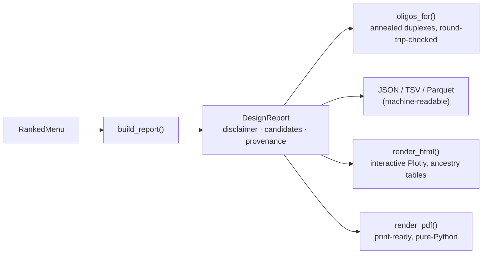

**Cloning oligos round-trip by construction.** `oligos_for(candidate)` dispatches
by chemistry; the cardinal invariant — enforced on build and re-checked by
`reconstruct()` — is that the oligos rebuild the intended spacer / RTT / PBS. A
design whose oligos do not reconstruct is a cloning error caught before synthesis.

| Chemistry | Oligos emitted | Default scheme |
|---|---|---|
| SpCas9 sgRNA | one duplex (vector 5' overhangs + U6 `G`) | lentiGuide BsmBI |
| Base-editor sgRNA | one duplex (standard sgRNA) | lentiGuide BsmBI |
| pegRNA | spacer duplex + 3' extension (RTT + PBS + epegRNA motif) + ngRNA duplex | pegRNA GG BsaI |

**Honest rendering.** HTML charts are interactive Plotly figures pulled from a CDN
with each figure's spec inlined as JSON — so no Python plotting dependency is
needed and **no sequence data leaves the page**. Off-target tables are
ancestry-stratified, surfacing the worst-affected population per candidate. The PDF
is a small self-contained writer (no weasyprint / reportlab) for a clean leave-behind.

```python
from alleleforge.report import build_report, render_html, render_pdf, report_to_tsv

report = build_report(menu, variant="chr11:5226778:T>A", intent="correct")
open("report.html", "w").write(render_html(report))     # interactive, self-contained
open("report.pdf", "wb").write(render_pdf(report))      # static, print-ready
open("menu.tsv", "w").write(report_to_tsv(report))      # one row per candidate
report.best.oligos.reconstruct()                         # ('spacer', 'rtt', 'pbs')
```

---

## The `aforge` CLI (Phase 12, shipping now)

A thin, reproducible, config-driven [Typer](https://typer.tiangolo.com/) shell over the library — **no
business logic of its own**. Every command resolves its inputs, calls the same functions the Python API
exposes, and can emit machine-readable JSON. Install with `pip install "alleleforge[cli]"`.

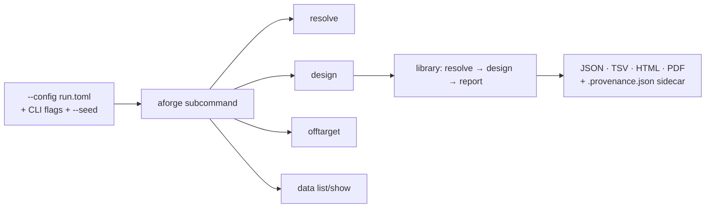

| Command | Purpose |
|---|---|
| `aforge resolve <input>` | Normalize any input form; show the canonical variant + class. |
| `aforge design <input>` | Variant → ranked, multi-chemistry menu rendered to JSON/TSV/HTML/PDF. |
| `aforge offtarget <spacer>` | Standalone population/haplotype-aware off-target search. |
| `aforge data list` / `show <name>` | Inspect the dataset registry (versions, licenses, provenance). |
| `aforge bench list` / `run` | List and run CRISPR-Bench tasks against frozen splits. |

Global options sit before the subcommand (`--seed`, `--reference`, `--cache-dir`, `--verbose`,
`--version`); every command takes `--json`. **Exit codes are distinct and scriptable**: `0` success,
`2` usage/input error, `3` missing data (e.g. reference FASTA not found), `4` an unavailable model or
feature. A run is reproducible from its echoed `--seed` + config (byte-identical modulo the UTC
timestamp), and a `<output>.provenance.json` sidecar is written next to every file output.

```bash
# Reproducible design from a config file; CLI flags override the file
aforge --seed 20240501 design chr2:71:A>C \
    --reference-fasta hg38.fa --config run.toml \
    --chemistry prime --weights 0.5,0.2,0.2,0.1 --format html --out report.html
# → wrote report.html and report.html.provenance.json
```

---

## Web UI & API (Phase 13, shipping now)

The accessible front door for users who will not touch a terminal: a **FastAPI** backend that exposes the
library over HTTP, and a **dependency-free served single-page frontend** that drives the variant-first
journey in the browser. The app is a thin async layer with **no business logic of its own** — it validates
each request with a pydantic model, calls the same functions the Python API and CLI use, and returns a
Phase 1 / Phase 11 schema-validated response, with OpenAPI auto-generated at `/docs`.

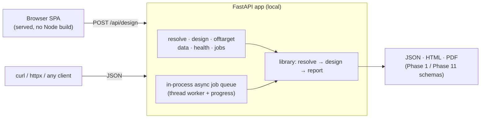

> [!IMPORTANT]
> **Local, private, no egress.** All compute is local and user-controlled. The app makes **no outbound
> network call** and transmits **no sequence data externally** — a guarantee enforced by a test that fails
> if any socket connects during a design request. The served frontend says so prominently and loads no
> third-party scripts.

| Method & path | Purpose |
|---|---|
| `GET /api/health` | Liveness, reference status, disclaimer |
| `POST /api/resolve` | Normalize any input form to a canonical variant |
| `POST /api/design` | Variant → ranked menu; `?format=json\|html\|pdf` |
| `POST /api/jobs/design` → `GET /api/jobs/{id}` | Async job submit + status/progress/result |
| `POST /api/offtarget` | Standalone population-aware off-target search |
| `GET /api/data` · `/api/data/{name}` | Inspect the dataset registry |
| `GET /` | The served single-page frontend |

```bash
# One-command local deploy (reference FASTA mounted at ./data/reference.fa)
docker compose up --build          # → http://localhost:8000  ·  /docs for OpenAPI

# Or run directly
pip install "alleleforge[web]"
ALLELEFORGE_REFERENCE_FASTA=hg38.fa uvicorn alleleforge.web.api.app:app --port 8000
```

The async job worker is **in-process** (the default deployment is single-user and local), so no broker or
separate worker container is needed; a multi-user deployment can swap in a real broker behind the same
`JobManager` interface. The served vanilla-JS frontend ships inside the wheel and is exercised end to end by
the API tests; a production Next.js + JBrowse 2 frontend can replace it behind the same API unchanged.

---

## CRISPR-Bench: a calibration-first benchmark (Phase 14, shipping now)

The sister deliverable and a field-level contribution in its own right: a **common yardstick** for guide- and
edit-design models — versioned datasets, **frozen content-hashed splits**, a fixed **five-task contract**, a
metric battery where **calibration is required on every task**, a runner that turns any `Scorer` into a
*signed* result, and a **model-card-gated leaderboard**. It is valuable independently of the rest of
AlleleForge, and the same scorers the designer uses are graded by it.

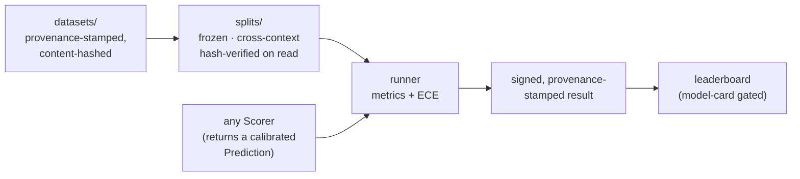

**The five tasks** — every chemistry AlleleForge designs for, plus off-target. Each reports its accuracy
metric **and** Expected Calibration Error, because a model that is accurate but overconfident is dangerous
for edit design:

| Task | Kind | Source corpus | Primary metric | + required |
|---|---|---|---|---|
| `cas9-efficiency` | regression | Rule Set 3, DeepHF/DeepSpCas9 | Spearman | Pearson, **ECE** |
| `cas9-outcome` | distribution | FORECasT, inDelphi, Lindel | KL ↓ | top-1, **ECE** |
| `be-outcome` | distribution | BE-Hive, BE-DICT | KL ↓ | top-1, **ECE** |
| `pe-efficiency` | regression | PRIDICT2 Library-Diverse | Spearman | Pearson, **ECE** |
| `offtarget-classification` | classification | GUIDE-seq / CHANGE-seq | AUROC | AUPRC, **ECE** |

**Frozen, content-hashed, cross-context splits.** A split is immutable once published. Each split file pins
its fold membership and two hashes — one over the **dataset content** it was cut from, one over its **own
membership** — and `load_split()` re-verifies both on read, raising `SplitIntegrityError` on any drift.
Changing the data, or the split, means minting a new *version*; you never edit a published one. Test folds
hold out a whole cell context, so the benchmark measures **generalization, not memorization** — the known
weak spot of guide models, made a headline feature instead of a footnote.

**Honest by construction.** Results are content-addressed (`signature`) so a published number cannot be
silently edited, and the leaderboard refuses any submission lacking a model card (name, license, citation) or
carrying a bad signature. The shipped datasets are **small synthetic fixtures** so the whole benchmark runs in
CI with no downloads; the real corpora are fetched at runtime through the same consent-gated registry as the
population data. See [`src/alleleforge/benchmark/README.md`](src/alleleforge/benchmark/README.md).

```bash
aforge bench list                                  # the five tasks, datasets, and metrics
aforge bench run cas9-efficiency                   # score the reference baseline on the frozen split
aforge bench run pe-efficiency --out result.json   # signed, provenance-stamped result JSON
```

```python
from alleleforge.benchmark import build_baseline, get_task, load_split, run_benchmark

task = get_task("offtarget-classification")
split, dataset = load_split(task.name)             # hash-verified on read
result = run_benchmark(build_baseline(task, split, dataset), task, split=split, dataset=dataset)
print(result.primary_metric, round(result.primary_value, 3), "ece", round(result.metrics["ece"], 3))
assert result.verify_signature()
```

> [!NOTE]
> The benchmark lives at `alleleforge.benchmark` (an installed subpackage) rather than the spec's sketched
> top-level `benchmark/` tree, so it ships in the wheel, is reachable from `aforge bench`, and is held to the
> same `mypy --strict` / ruff / coverage gates as the rest of the library.

---

## Defaults cheat-sheet

Every default is overridable; these are the spec-mandated starting points.

| Topic | Default | Notes |
|---|---|---|
| Reference / coordinates | hg38, **0-based half-open** | T2T-CHM13 auto-recommended for ambiguous loci; mm39 for mouse |
| Strand | always explicit | no implicit "default strand"; spacers stored 5'→3' |
| SpCas9 PAM | `NGG` (primary), `NAG` low-stringency | NG / SpRY opt-in when no NGG is actionable |
| Off-target search | ≤ 4 mismatches, ≤ 1 DNA + ≤ 1 RNA bulge | report CFD ≥ 0.20 **or** MIT ≥ 0.10 |
| Population inclusion | MAF ≥ 0.001, all populations | de-novo PAM &amp; seed-mismatch changes always evaluated |
| Base-editing window | protospacer positions **4–8** | ABE8e (A→G), CBE4max / evoCDA1 (C→T); bystanders always reported |
| Prime editing | **PE5max + epegRNA (tevopreQ1)** | PBS 8–17 nt, RTT 7–34 nt; PE3b nicking guide when seed-disrupting |
| Uncertainty | **80%** predictive interval | deep ensemble (N=5) + isotonic calibration |
| Seed | `20240501` | threaded through every stochastic step, recorded in provenance |

---

## Project layout

```
alleleforge/
├── pyproject.toml            # hatchling build, deps, ruff/mypy/pytest config
├── SPEC.md                   # the authoritative, phase-by-phase build contract
├── rust/                     # PyO3 crate: aforge_native (BWT, k-mer, haplotype)
├── src/alleleforge/
│   ├── config.py             # typed Settings (pydantic-settings), defaults, paths
│   ├── _native.py            # optional Rust bridge
│   ├── types/                # Phase 1: core domain vocabulary
│   ├── genome/               # Phase 2: reference access, FM-index, liftover
│   ├── data/                 # Phase 3: registry, ClinVar, gnomAD, 1000G/HGDP, dbSNP, annotations
│   ├── variant/              # Phase 4: resolver, HGVS adapter, consequence
│   ├── offtarget/            # Phase 5: population/haplotype-aware off-target
│   ├── model_zoo/            # Phase 6: license-gated model cards + checkpoints
│   ├── scoring/              # Phase 6: embeddings, uncertainty, Scorer (this release)
│   ├── enumerate/            # Phases 7–9: SpCas9 guide · base-editor window · pegRNA enumeration
│   ├── design/               # Phases 7–10: nuclease · base · prime verticals + designer (routing · ranking)
│   ├── report/               # Phase 11: oligos · report builder · JSON/TSV/Parquet · HTML · PDF
│   ├── cli/                   # Phase 12: the aforge Typer CLI (resolve · design · offtarget · data · bench)
│   ├── web/                   # Phase 13: FastAPI api/ + served frontend/ (variant-first journey)
│   ├── benchmark/             # Phase 14: CRISPR-Bench — tasks · datasets · frozen splits · runner · leaderboard
│   └── ...
├── tests/                    # mirrors src/; pytest + hypothesis
├── scripts/                  # schema export · benchmark-fixture generator
└── docs/                     # mkdocs-material site
```

---

## Development

```bash
pip install -e ".[dev]"
ruff check src tests           # lint + import order + docstrings
ruff format --check src tests  # formatting
mypy src                       # strict type-check
pytest                         # tests + ≥85% coverage gate on core
cd rust && cargo test && maturin develop   # native crate
```

CI (GitHub Actions) runs lint, type-check (`mypy --strict`), tests (Python 3.11 + 3.12 on Linux &amp; macOS),
and a strict docs build on every push and PR. See [`.github/workflows/ci.yml`](.github/workflows/ci.yml).
The native Rust crate builds locally with maturin (`cd rust && maturin develop`); the library runs in
pure-Python mode without it.

Contributions are welcome — please read [`CONTRIBUTING.md`](CONTRIBUTING.md) and the
[Contributor Covenant 2.1](CODE_OF_CONDUCT.md) code of conduct.

---

## Scope &amp; responsible use

- **Research use only.** AlleleForge produces hypotheses and rankings, not medical advice or clinical
  decisions. Every generated report repeats this.
- **Off-target predictions require experimental validation.** Computational nomination narrows the search;
  it does not replace GUIDE-seq / CHANGE-seq / amplicon confirmation.
- **No telemetry, no phone-home.** All computation runs locally or on user-controlled infrastructure.
  User sequences are never transmitted externally.
- **Honest uncertainty over false confidence.** Where models are out of distribution (e.g., prime-editing
  efficiency outside PRIDICT's HEK293T / K562 training context), AlleleForge flags it rather than hiding it.
- **Dual-use awareness.** This is a design and safety-analysis tool for legitimate therapeutic and basic
  research. It contains no wet-lab protocols or synthesis instructions.

---

## License

AlleleForge is released under the [MIT License](LICENSE) — all code, schemas, benchmark, and any first-party
model weights. It is fully open source and free to use, modify, and redistribute.

Each wrapped third-party tool or model retains its own upstream license, recorded in its model/tool card; the
registry refuses to bundle any component whose license is incompatible with redistribution and fetches it at
runtime with the user's consent instead.

## Citation

If you use AlleleForge, please cite it via [`CITATION.cff`](CITATION.cff). A Zenodo DOI is minted on the first
tagged release.
