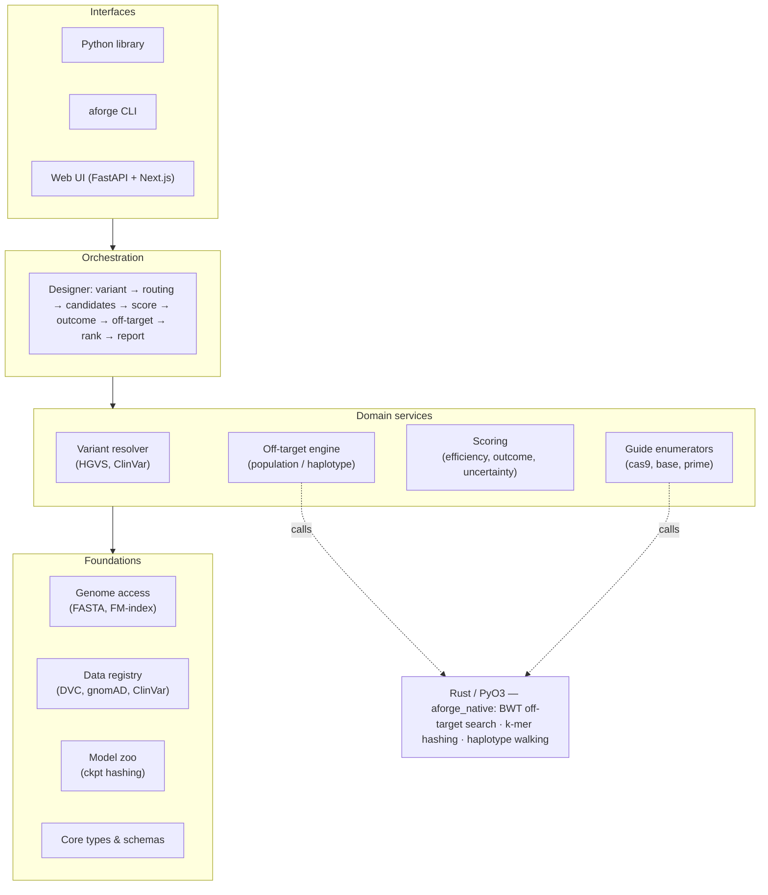

<div align="center">

# AlleleForge

**Variant in, corrective edit out.**

A variant-driven, multi-modality, uncertainty-aware CRISPR guide &amp; edit design framework —
across SpCas9 nuclease, base editors, and prime editors, with **population-aware** off-target
nomination and a public benchmark.

[](https://github.com/clay-good/alleleforge/actions/workflows/ci.yml)
[](https://www.python.org/)
[](LICENSE)
[](https://mypy-lang.org/)
[](https://github.com/astral-sh/ruff)

</div>

---

> [!WARNING]
> **AlleleForge is a research tool. It is not a medical device and does not provide medical advice.**
> It produces ranked, explicitly *uncertain* design hypotheses. Every off-target nomination it makes is
> **computational** and **must be experimentally validated** before any wet-lab or therapeutic use.
> See [Scope &amp; responsible use](#scope--responsible-use).

---

## Why AlleleForge

Most monogenic disease is, in effect, a copy-paste error at the allele level. The job of a genome editor
is to forge the corrective edit. Today that job is fragmented across a dozen single-purpose tools — one to
pick a guide, another to predict efficiency, a third to enumerate prime-editing extensions, a fourth to scan
for off-targets — none of which speak the same language and few of which agree on what "uncertain" means.

AlleleForge unifies the journey behind **one typed interface**: you supply a variant, it returns a ranked,
safety-annotated menu of candidate edits spanning every applicable modality, each carrying a **calibrated
uncertainty interval**, a **predicted edit outcome**, and a **population- and haplotype-aware off-target
report**.

### The four-axis gap it fills

For prime editing in particular, no existing open-source tool combines all four of:

| Axis | PRIDICT2.0 | PrimeDesign / PrimeVar | CRISPRme | **AlleleForge** |
|---|:---:|:---:|:---:|:---:|
| Therapeutic **variant** front-end | ✗ | ✓ | ✗ | ✓ |
| **ML efficiency** with calibrated uncertainty | ✓ | ✗ | ✗ | ✓ |
| **Outcome / byproduct** prediction | partial | ✗ | ✗ | ✓ |
| **Population-aware** off-target | ✗ | ✗ | ✓ | ✓ |

AlleleForge's contribution is to **wrap the best existing models** (PRIDICT2.0, BE-Hive, BE-DICT, inDelphi,
Cas-OFFinder, …) behind a unified, typed, uncertainty-honest interface and add value at the seams.

---

## Design principles

1. **Variant-first.** The canonical journey starts from *what is broken*, not from a guide.
2. **Honest uncertainty.** Every numeric prediction ships with a calibrated interval. No scorer returns a bare float.
3. **Population-aware by default.** Reference-only off-target analysis is a known safety gap (the Casgevy /
   BCL11A `rs114518452` case is the canonical cautionary tale). AlleleForge searches population variation by default.
4. **Wrap, don't rebuild.** Integrate proven tools; add new ML only at genuine coverage gaps.
5. **Reproducible to the byte.** Pinned environments, versioned datasets, deterministic seeds, content-hashed checkpoints.
6. **Three audiences, one core.** The library is the source of truth; CLI and web are thin shells over it.
7. **Typed and tested.** `mypy --strict`, `ruff`, and Hypothesis property tests on all core logic.
8. **Cite everything.** Every dataset, model, and scoring function carries a literature citation and a version.

---

## Architecture

AlleleForge is strictly layered: lower layers know nothing about higher ones. The **Designer** is the only
component that sees the whole pipeline; every domain service is independently testable and usable.



### The variant-first journey

```mermaid
sequenceDiagram
    actor U as User
    participant R as Resolver
    participant Rt as Router
    participant E as Enumerators
    participant S as Scorers
    participant X as Off-target engine
    participant K as Ranker

    U->>R: ClinVar / rsID / HGVS / VCF / coords
    R->>Rt: normalized Variant + consequence
    Rt->>E: eligible modalities (nuclease / base / prime)
    E->>S: candidate guides &amp; pegRNAs
    S->>S: efficiency + outcome (calibrated Prediction)
    E->>X: spacers / nicks
    X->>X: reference → population → haplotype → patient VCF
    S->>K: scored candidates
    X->>K: ancestry-stratified off-target reports
    K-->>U: RankedMenu (+ Pareto front, provenance, disclaimer)
```

---

## Build status &amp; roadmap

AlleleForge is built in ordered phases (see [`SPEC.md`](SPEC.md), the authoritative build contract). Phases
0–5 establish the spine before any modality or ML code.

| Phase | Component | Status |
|---|---|:---:|
| 0 | Repo bootstrap, CI, packaging, Rust toolchain | ✅ done |
| 1 | Core domain types &amp; schemas (`types/`) | ✅ done |
| 2 | Genome access &amp; indexing (`genome/`) | ⏳ next |
| 3 | Data registry &amp; population datasets (`data/`) | ◻️ planned |
| 4 | Variant resolver (`variant/`) | ◻️ planned |
| 5 | Off-target engine — population &amp; haplotype aware (`offtarget/`) | ◻️ planned |
| 6 | Scoring foundations: model zoo, embeddings, uncertainty | ◻️ planned |
| 7–9 | Modalities: SpCas9 nuclease · base editing · prime editing | ◻️ planned |
| 10 | Designer: routing, candidate menu, ranking | ◻️ planned |
| 11 | Reporting &amp; oligo output | ◻️ planned |
| 12 | CLI (`aforge`) | ◻️ planned |
| 13 | Web UI &amp; API | ◻️ planned |
| 14 | CRISPR-Bench: benchmark, splits, leaderboard | ◻️ planned |
| 15 | Docs, examples, release | ◻️ planned |

---

## Install

> AlleleForge targets **Python ≥ 3.11**. The core install is deliberately light; heavy scientific, ML, and
> web stacks live in optional dependency groups so the base package installs fast and CI stays reliable.

```bash
# Core library (pure-Python: pydantic types, config)
pip install alleleforge            # once published to PyPI

# From source, with the optional groups you need
git clone https://github.com/clay-good/alleleforge
cd alleleforge
pip install -e ".[core,genome,variant,ml,dev]"
```

### Optional dependency groups

| Group | Pulls in | Needed for |
|---|---|---|
| `core` | polars, pyarrow, numpy | tabular I/O |
| `genome` | pyfaidx, pysam, cyvcf2, mappy, pyliftover | reference access, indexing (Phase 2) |
| `variant` | hgvs | HGVS resolution (Phase 4) |
| `ml` | torch, lightning, scikit-learn | scoring &amp; uncertainty (Phase 6+) |
| `web` | fastapi, uvicorn | API server (Phase 13) |
| `docs` | mkdocs-material, mkdocstrings | documentation site |
| `dev` | ruff, mypy, pytest, hypothesis, maturin | development |

### Native acceleration (optional)

The performance kernels live in a PyO3 crate built with [maturin](https://github.com/PyO3/maturin).
AlleleForge imports and runs cleanly **without** it (pure-Python mode); build it for speed:

```bash
pip install maturin
cd rust && maturin develop --release      # builds & installs aforge_native
```

`alleleforge._native.NATIVE_AVAILABLE` reports whether the compiled extension is present.

---

## Quickstart

> The end-to-end design pipeline lands incrementally across Phases 4–12. Today the package exposes the
> stable **core vocabulary** and **configuration**; the snippets below are guaranteed to work now, with the
> full `design()` call arriving as the modality phases complete.

```python
import alleleforge as af

print(af.__version__)

# Resolve global settings (XDG cache, seed, reference build, MAF threshold).
settings = af.get_settings()
print(settings.reference, settings.seed, settings.maf_threshold)
```

```python
from alleleforge.types import DNASequence, Strand, Prediction, UncertaintyMethod

seq = DNASequence("ACGTRYN")          # validates IUPAC alphabet
print(seq.reverse_complement())        # ambiguity-aware: R↔Y, N↔N → "NRYACGT"

# Every numeric prediction carries a calibrated interval, never a bare float.
p = Prediction(value=0.72, interval=(0.61, 0.83), method=UncertaintyMethod.ENSEMBLE,
               in_distribution=True, calibrated=True)
print(p.interval_level)                # 0.80 by default
```

The target journey (Phase 12 CLI):

```bash
# Variant → ranked, safety-annotated menu of candidate edits
aforge design --clinvar VCV000012345 --intent correct --populations all

# Standalone population/haplotype-aware off-target for a spacer
aforge offtarget --spacer GACGGAGGCTAAGCGTCGCAA --pam NGG

# Normalize any input form and show its consequence (debugging aid)
aforge resolve --hgvs "NM_000518.5:c.20A>T"
```

---

## Defaults cheat-sheet

Every default is overridable; these are the spec-mandated starting points.

| Topic | Default | Notes |
|---|---|---|
| Reference / coordinates | hg38, **0-based half-open** | T2T-CHM13 auto-recommended for ambiguous loci; mm39 for mouse |
| Strand | always explicit | no implicit "default strand"; spacers stored 5'→3' |
| SpCas9 PAM | `NGG` (primary), `NAG` low-stringency | NG / SpRY opt-in when no NGG is actionable |
| Off-target search | ≤ 4 mismatches, ≤ 1 DNA + ≤ 1 RNA bulge | report CFD ≥ 0.20 **or** MIT ≥ 0.10 |
| Population inclusion | MAF ≥ 0.001, all populations | de-novo PAM &amp; seed-mismatch changes always evaluated |
| Base-editing window | protospacer positions **4–8** | ABE8e (A→G), CBE4max / evoCDA1 (C→T); bystanders always reported |
| Prime editing | **PE5max + epegRNA (tevopreQ1)** | PBS 8–17 nt, RTT 7–34 nt; PE3b nicking guide when seed-disrupting |
| Uncertainty | **80%** predictive interval | deep ensemble (N=5) + isotonic calibration |
| Seed | `20240501` | threaded through every stochastic step, recorded in provenance |

---

## Project layout

```
alleleforge/
├── pyproject.toml            # hatchling build, deps, ruff/mypy/pytest config
├── SPEC.md                   # the authoritative, phase-by-phase build contract
├── rust/                     # PyO3 crate: aforge_native (BWT, k-mer, haplotype)
├── src/alleleforge/
│   ├── config.py             # typed Settings (pydantic-settings), defaults, paths
│   ├── _native.py            # optional Rust bridge
│   ├── types/                # Phase 1: core domain vocabulary (this release)
│   ├── genome/ data/ variant/ offtarget/   # Phases 2–5 (foundations + safety core)
│   ├── enumerate/ scoring/ model_zoo/      # Phases 6–9 (ML + modalities)
│   ├── design/ report/ cli/ web/           # Phases 10–13 (orchestration + interfaces)
│   └── ...
├── tests/                    # mirrors src/; pytest + hypothesis
├── benchmark/                # CRISPR-Bench (Phase 14)
└── docs/                     # mkdocs-material site
```

---

## Development

```bash
pip install -e ".[dev]"
ruff check src tests           # lint + import order + docstrings
ruff format --check src tests  # formatting
mypy src                       # strict type-check
pytest                         # tests + ≥85% coverage gate on core
cd rust && cargo test && maturin develop   # native crate
```

CI (GitHub Actions) runs lint, type-check, tests (Python 3.11 + 3.12 on Linux &amp; macOS), the Rust build,
and a docs build on every push and PR. See [`.github/workflows/ci.yml`](.github/workflows/ci.yml).

Contributions are welcome — please read [`CONTRIBUTING.md`](CONTRIBUTING.md) and the
[Contributor Covenant 2.1](CODE_OF_CONDUCT.md) code of conduct.

---

## Scope &amp; responsible use

- **Research use only.** AlleleForge produces hypotheses and rankings, not medical advice or clinical
  decisions. Every generated report repeats this.
- **Off-target predictions require experimental validation.** Computational nomination narrows the search;
  it does not replace GUIDE-seq / CHANGE-seq / amplicon confirmation.
- **No telemetry, no phone-home.** All computation runs locally or on user-controlled infrastructure.
  User sequences are never transmitted externally.
- **Honest uncertainty over false confidence.** Where models are out of distribution (e.g., prime-editing
  efficiency outside PRIDICT's HEK293T / K562 training context), AlleleForge flags it rather than hiding it.
- **Dual-use awareness.** This is a design and safety-analysis tool for legitimate therapeutic and basic
  research. It contains no wet-lab protocols or synthesis instructions.

---

## License

AlleleForge is released under the [MIT License](LICENSE) — all code, schemas, benchmark, and any first-party
model weights. It is fully open source and free to use, modify, and redistribute.

Each wrapped third-party tool or model retains its own upstream license, recorded in its model/tool card; the
registry refuses to bundle any component whose license is incompatible with redistribution and fetches it at
runtime with the user's consent instead.

## Citation

If you use AlleleForge, please cite it via [`CITATION.cff`](CITATION.cff). A Zenodo DOI is minted on the first
tagged release.
