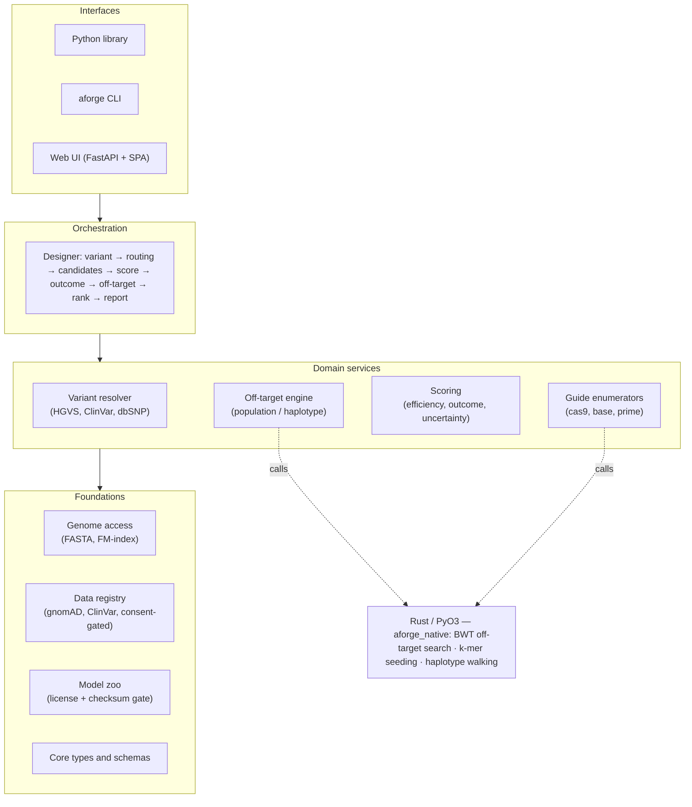
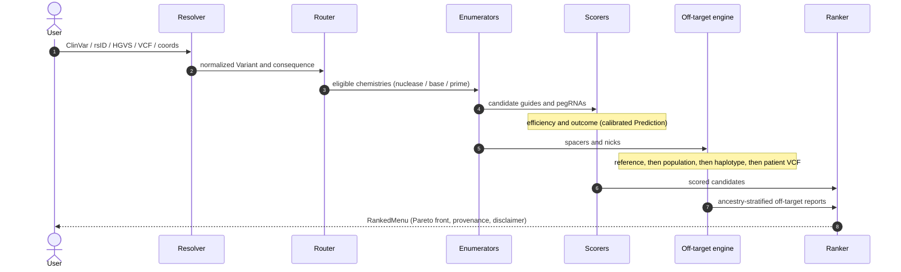

# AlleleForge

**Variant in, corrective edit out.**

AlleleForge is a variant-driven, multi-modality, uncertainty-aware CRISPR guide and edit design
framework spanning SpCas9 nuclease, base editors, and prime editors, with population- and
haplotype-aware off-target nomination and a public benchmark (CRISPR-Bench).

!!! warning "Research tool — not medical advice"
    AlleleForge produces ranked, explicitly *uncertain* design hypotheses. Every off-target
    nomination is **computational** and **must be experimentally validated**. It is not a medical
    device and provides no medical advice. See [Scope & responsible use](scope.md).

## What it does

You supply a variant (ClinVar accession, dbSNP rsID, HGVS, VCF record, raw coordinates, or a raw
target sequence). AlleleForge returns a ranked, safety-annotated menu of candidate edits across
every applicable chemistry, each carrying:

- a **calibrated uncertainty interval** on efficiency (never a bare float);
- a **predicted edit outcome** distribution (indels / bystanders / byproducts);
- a **population- and haplotype-aware off-target report**, ancestry-stratified by default.

## Architecture at a glance

AlleleForge is strictly layered — lower layers know nothing about higher ones, and the **Designer** is
the only component that sees the whole pipeline. Every domain service is independently testable and
usable on its own.



The variant-first request flows through the pipeline in one pass:



## Build status

All fifteen v0.1.0 phases are **complete**: three chemistries end to end with honest uncertainty and the
benchmark. AlleleForge is built in ordered phases against
[the specification](https://github.com/clay-good/alleleforge/blob/main/SPEC.md) — the foundations land
before any chemistry-specific or ML code.

| Phase | Component | Status |
|---|---|:---:|
| 0 | Repo bootstrap, CI, packaging, Rust toolchain | done |
| 1 | Core domain types & schemas (`types/`) | done |
| 2 | Genome access & indexing (`genome/`) | done |
| 3 | Data registry & population datasets (`data/`) | done |
| 4 | Variant resolver (`variant/`) | done |
| 5 | Off-target engine — population & haplotype aware (`offtarget/`) | done |
| 6 | Scoring foundations: model zoo, embeddings, uncertainty (`scoring/`, `model_zoo/`) | done |
| 7 | Chemistry: SpCas9 nuclease (`enumerate/`, `scoring/`, `design/`) | done |
| 8 | Chemistry: base editing — ABE / CBE | done |
| 9 | Chemistry: prime editing — the flagship (`enumerate/`, `scoring/`, `design/`) | done |
| 10 | Designer: routing, multi-chemistry candidate menu, ranking (`design/`) | done |
| 11 | Reporting & oligo output (`report/`) | done |
| 12 | CLI (`aforge`) (`cli/`) | done |
| 13 | Web UI & API (`web/`) | done |
| 14 | CRISPR-Bench: benchmark, splits, leaderboard | done |
| 15 | Documentation, examples, release | done |

Post-v0.1.0 work to "bake" the release toward v1.0 (real weights through the consent-gated model zoo,
native kernels on the hot paths, external-tool adapters, scale, and validation) is tracked in
[`SPEC_V2.md`](https://github.com/clay-good/alleleforge/blob/main/SPEC_V2.md). See
[Data provenance](data.md) for the versioned, license-aware dataset registry.

## The uncertainty contract in one snippet

```python
from alleleforge.types import Prediction, UncertaintyMethod

p = Prediction(
    value=0.72,
    interval=(0.61, 0.83),           # calibrated 80% predictive interval
    method=UncertaintyMethod.ENSEMBLE,
    in_distribution=True,
    calibrated=True,
)
assert p.interval[0] <= p.value <= p.interval[1]   # always holds
```

See the [uncertainty contract](concepts/uncertainty.md) and [population-aware safety](concepts/population.md)
concept pages, and the [core types reference](api/types.md).
